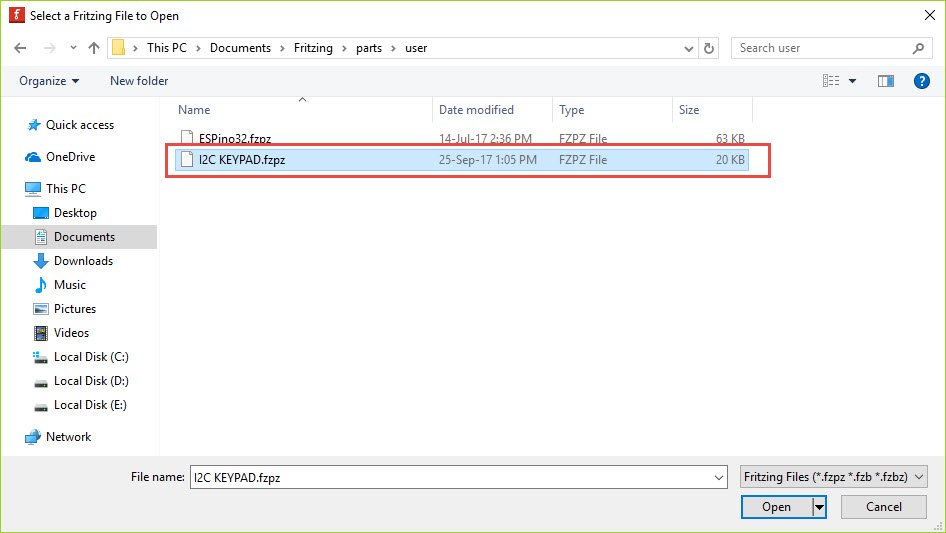
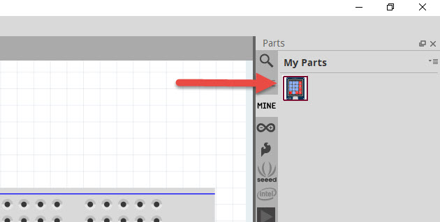
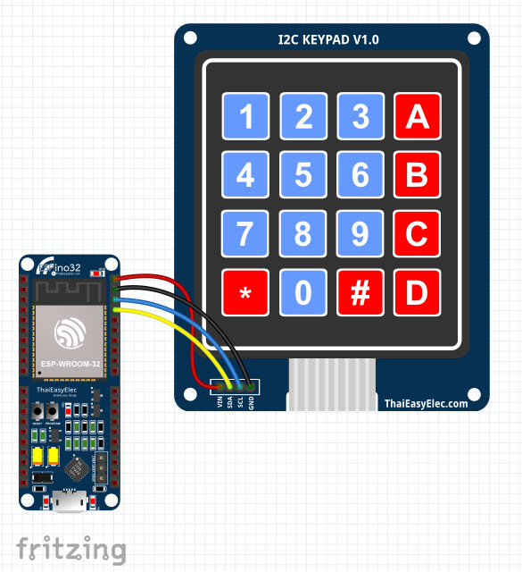

# I2C KEYPAD Fritzing Part

I2C KEYPAD Fritzing Part คือ Modelของบอร์ด I2C KEYPAD ที่ทาง ThaiEasyElec ได้สร้างขึ้นมาเพื่อใช้ร่วมกับ Program Fritzing เพื่อให้ผู้ใช้ที่ต้องการสร้าง
 รูปภาพแผนผังการต่อวงจร สามารถสร้างได้สะดวกมากขึ้น
 
## วิธีติดตั้ง I2C KEYPAD Fritzing Part

1. Copy File I2C KEYPAD.fzpz ไปยัง -->C:\Users\computer name\Documents\Fritzing\parts\user

2. เปิด Program Fritzing ขึ้นมา
3. เลือก Part "MINE" (1)

4. คลิกขวา เลือก Import (2)
 

5. เลือก File I2C KEYPAD.fzpz ที่ -->C:\Users\computer name\Documents\Fritzing\parts\user และ คลิกOPEN

6. จะปรากฎ Part ESPino32 ให้ขึ้นมา

7. สามารถวาดผังวงจรตามต้องการ

