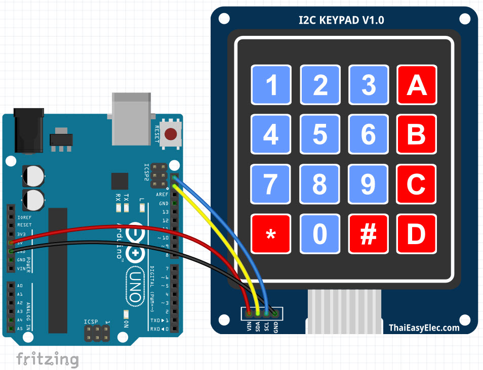
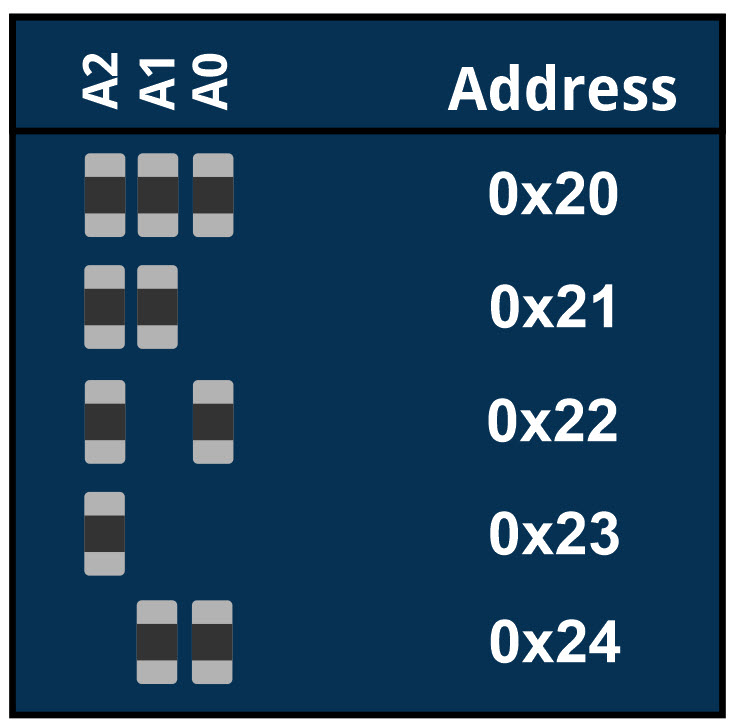

# I2C Keypad
I2C Keypad คือ โมดูลที่นำเอา Keypad มาเชื่อมต่อกับ IC เบอร์ PCF8574 ซึ่งเป็น IC สำหรับขยายพอร์ต Digital Input/Output สั่งงานผ่านทาง I2C ทำให้การเชื่อมต่อ
ระหว่าง Microcontroller กับ Keypad ใช้ขา Digital I/O ลดน้อยลง สะดวกในการใช้งานมากขึ้น เหมาะสำหรับใช้กับ Microcontroller ที่มี I/O น้อยหรือต้องการลดการเชื่อมต่อสายลง
## ภาพการเชื่อมต่อ I2C Keypad กับ Arduino 

## ภาพการเชื่อมต่อ I2C Keypad กับ ESPino32

## I2C Address
- โดย Default Address ของ I2C ของ Keypad คือ 0x20
- สามารถเปลี่ยน Address ได้จากการบัดกรีตัว R ที่ต่อขา A0, A1, A2 ด้านหลังของบอร์ด

- ตารางการตั้งค่า Address

